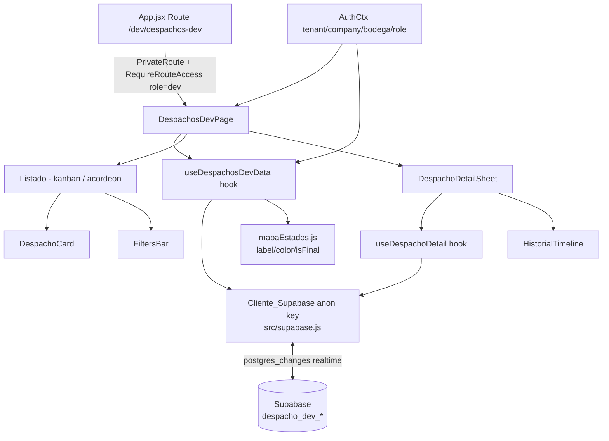

# Documento de Diseño — Despachos Dev

## Overview

"Despachos Dev" es una página administrativa de **solo lectura** dentro de AppoloDesk (SPA React 19) que vive en el área Dev (`/dev`, requiere rol `dev`). Consume **exclusivamente** datos del proyecto Supabase compartido con la app móvil OLOso; **no** usa Firebase para sus datos de negocio.

La página ofrece tres experiencias sobre el mismo conjunto de despachos del scope del usuario:

1. **Listado agrupado por estado**: tablero kanban (viewport ≥ 1024px) o acordeón/pestañas (< 1024px), con barra de filtros (búsqueda, estado múltiple, rango de fechas) y contador de resultados.
2. **Detalle de solo lectura**: `Sheet` (Drawer/Modal) del UI kit con datos de negocio, estado actual, datos del chofer y exportación opcional.
3. **Historial (bitácora inmutable)**: línea de tiempo vertical construida desde `despacho_dev_actividad`.

Todo se actualiza en tiempo real vía suscripciones de Supabase Realtime, con degradación elegante cuando realtime no está disponible.

### Modelo de alcance (Opción A — alcance único)

El usuario ve **únicamente** los despachos de su propia bodega. El scope (`tenant_id`, `company`, `bodega_id`) se deriva del perfil Firebase (`AuthCtx`), igual que el resto de la app. El código deja `tenant_id`/`company`/`bodega_id` como **props/filtros opcionales** para habilitar una futura vista multi-scope (Opción B) sin refactor mayor (Requirement 10).

### Hallazgo de arquitectura sobre RLS (importante)

Los Requirements describen el filtrado por RLS mediante `dd_tenant_id()`/`dd_company()`/`dd_bodega_id()` a partir de claims del JWT. **En el estado actual del repositorio**, el cliente Supabase (`src/supabase.js`) se crea solo con la **clave anónima** y la app **no** abre una sesión de autenticación de Supabase: la identidad de negocio vive en Firebase Auth + `profiles/{uid}`. En consecuencia, dentro de la SPA no existe un JWT de Supabase que porte esos claims, por lo que las funciones `dd_*()` **no reciben automáticamente** el scope del usuario.

El patrón real ya usado por MRP Tarimas (`src/services/mrp/*`, `src/utils/dataScope.js`) es: **filtrado explícito de scope en cada consulta** (`.eq("tenant_id", …).eq("company", …).eq("bodega_id", …)`) derivado de `AuthCtx`, más **filtrado defensivo en cliente**. Este diseño adopta el mismo enfoque como mecanismo de enforcement dentro de la SPA, y trata la RLS como **autoridad de respaldo en el backend** (defensa en profundidad) para cuando exista una sesión Supabase con claims. Esto satisface la intención de los Requirement 9.1/9.2/9.6 sin depender de una capacidad que hoy no está presente. Ver "Decisión D1" y la sección de extensiones futuras.

## Architecture

### Diagrama de alto nivel



### Capas y responsabilidades

- **Ruteo y gate de acceso**: `src/App.jsx` declara la ruta `/dev/despachos-dev` envuelta en `PrivateRoute`. `src/config/routeAccess.js` ya cubre el prefijo `/dev` con `{ roles: ["dev"], adminOverride: false }`. Se añade una entrada de módulo en `src/config/workAreas.jsx` (área `dev`) para exponerla en la navegación.
- **Página contenedora** (`DespachosDevPage`): orquesta estado de UI (carga/error/vacío/sin-permiso), responsividad (kanban vs acordeón) y coordina hooks de datos y realtime.
- **Capa de datos** (hooks + servicio Supabase): consultas de catálogo, listado, detalle e historial; construcción de filtros de scope; suscripciones realtime y su limpieza.
- **Capa de dominio pura** (`mapaEstados.js` + utilidades): mapeo de estados, agrupación/orden, filtrado, formateo de tiempo relativo, placeholders de ausencia, detección de transición en historial. **Todo esto es lógica pura y testeable por propiedades.**
- **Presentación** (componentes UI): reutiliza el UI kit (`Sheet`, `Badge`, `SearchInput`, `EmptyState`, `ErrorState`, `Skeleton`, `Card`) desde el barrel `src/components/ui`.

### Enforcement de scope (defensa en profundidad)

1. **Filtro explícito en consulta** (primario en SPA): toda consulta añade `.eq("tenant_id", scope.tenantId).eq("company", scope.company).eq("bodega_id", scope.bodegaId)` cuando los valores existen. El orden de filtros y el `.order("created_at", { ascending: false })` se estructuran para aprovechar el índice `(tenant_id, company, bodega_id, estado, created_at desc)` (Requirement 9.6).
2. **Filtrado defensivo en cliente**: los eventos realtime y cualquier fila recibida se pasan por `isInUserScope(row, tenantId, company, bodegaId)` (`src/utils/dataScope.js`) antes de mutar el estado visible (Requirement 7.3).
3. **RLS de respaldo (backend)**: se documenta y se mantiene sin modificar; es autoritativa cuando exista sesión Supabase con claims (Requirement 9.2 — no se altera ninguna política).

La clave de servicio (service role) **nunca** se usa en el frontend. El único cliente disponible es el anónimo exportado en `src/supabase.js`; el diseño no importa ni referencia ninguna service role (Requirement 9.3/9.4).

### Estrategia de realtime

- Al montar, la página abre un canal `supabase.channel("despachos-dev-list")` suscrito a `postgres_changes` sobre `public.despacho_dev_despachos` con `filter` por `bodega_id=eq.<scope>` cuando aplica.
- Los eventos entrantes se filtran de nuevo en cliente por scope; se aplica un reconciliador que actualiza/inserta/elimina el despacho afectado en el estado local sin recargar, preservando scroll y filtros (Requirement 7.2).
- El detalle abre un segundo canal `despacho-dev-actividad-<id>` para el historial del despacho activo (Requirement 7.4).
- **Limpieza**: cada `useEffect` que crea un canal retorna una función que llama `supabase.removeChannel(channel)`. El array de dependencias es completo (scope + id) para cumplir `react-hooks/exhaustive-deps` y no dejar suscripciones colgadas (Requirement 7.5, 11.6).
- **Degradación**: se observa el estado del canal (`subscribe((status) => …)`). Si el estado no es `SUBSCRIBED` (p. ej. `CHANNEL_ERROR`, `TIMED_OUT`, `CLOSED`), se marca `realtimeStatus = "inactivo"`, se muestra un indicador no bloqueante y se reintenta cada 15s; al reconectar, el indicador se retira en ≤ 5s (Requirement 7.6, 7.7).

### Responsividad kanban ↔ acordeón

Se usa el hook existente `useIsMobile(1023)` (media query `max-width: 1023px`) para conmutar entre `KanbanBoard` y `AccordionGroups`. El cambio es puramente de render condicional sobre el mismo estado ya cargado, por lo que la transición ocurre muy por debajo de 500ms sin recargar (Requirement 2.8).

## Components and Interfaces

### Estructura de archivos propuesta

```
src/pages/Dev/DespachosDev/
  DespachosDevPage.jsx        # contenedor + estados UI + responsividad
  components/
    FiltersBar.jsx            # búsqueda + estado múltiple + rango fechas + contador + mini-resumen
    KanbanBoard.jsx           # columnas por estado (desktop)
    AccordionGroups.jsx       # secciones por estado (mobile)
    DespachoCard.jsx          # tarjeta de despacho
    EstadoBadge.jsx           # insignia de estado (color+texto) sobre Badge del UI kit
    DespachoDetailSheet.jsx   # detalle solo lectura sobre Sheet del UI kit
    HistorialTimeline.jsx     # línea de tiempo vertical
    RealtimeIndicator.jsx     # indicador no bloqueante de realtime inactivo
  hooks/
    useDespachosDevData.js    # catálogo + listado + realtime del listado
    useDespachoDetail.js      # detalle + chofer + historial + realtime del detalle
  lib/
    mapaEstados.js            # label/color/isFinal + mapa local color/icono
    despachoFilters.js        # filtrado puro (texto/estado/fecha) + validación de rango
    despachoGrouping.js       # agrupación + orden de grupos y de tarjetas
    despachoFormat.js         # tiempo relativo, placeholders, formato "S/D"
    historialDetalle.js       # detección de transición estadoAnterior/estadoNuevo
    exportDespacho.js         # exportación opcional (jspdf / exceljs) — carga perezosa
```

### `mapaEstados.js` (dominio puro)

```js
// Colores/íconos: mapa local (Requirement 1.4). nombre/orden: del Catalogo_Estados (1.3).
// Tokens de color se añaden a src/styles/theme.js (ver Data Models / Requirement 11.4-11.5).
export const ESTADO_FINAL = new Set(["despachado", "finalizado"]);
export const ESTADO_NEUTRO = { color: /* theme.ESTADO_NEUTRO */ "#9ca3af", icono: "FileText" };

// buildMapaEstados(catalogo) -> { get(codigo), label(codigo), color(codigo), isFinal(codigo) }
export function buildMapaEstados(catalogo) { /* … */ }

// Helpers deterministas independientes del catálogo:
export function isFinal(codigo)  // true SOLO para 'despachado' | 'finalizado' (1.7)
export function colorFor(codigo) // color local o neutro #9ca3af si no existe (1.5)
export function labelFor(codigo, catalogo) // nombre del catálogo, o el propio código si no existe (1.5)
```

Mapa local (Requirement 1.4): `creado`→#6b7280/FileText; `en proceso`→#2563eb/Loader; `chofer_pendiente`→#d97706/UserRound; `completo`→#0891b2/CheckCircle2; `pendiente_validacion`→#7c3aed/ClipboardCheck; `despachado`→#059669/Truck; `rechazado`→#dc2626/XOctagon; `eliminado`→#9ca3af/Trash2; `finalizado`→#0891b2/Lock. Estos valores se registran como **tokens** en `theme.js` (`ESTADO_COLORS`, `ESTADO_ICONS`) para cumplir 11.4/11.5; `mapaEstados.js` los consume desde el tema.

### `despachoGrouping.js` (dominio puro)

- `groupByEstado(despachos, catalogo)`: devuelve grupos `{ codigo, nombre, orden, despachos: [] }` solo para estados del catálogo con ≥ 1 despacho; excluye `eliminado` (2.2, 2.5).
- Orden de grupos: ascendente por `orden`; desempate alfabético ascendente por `nombre` (2.3).
- Orden de despachos dentro del grupo: `created_at` descendente; desempate por `id` descendente (2.4).

### `despachoFilters.js` (dominio puro)

- `filterDespachos(despachos, { texto, estados, desde, hasta })`: conjunción de los tres filtros (4.5).
  - Texto: coincidencia parcial, insensible a mayúsculas, sobre `referencia`, `tienda`, `placa` (4.1).
  - Estados: si `estados` está vacío ⇒ todos; si no, `estado ∈ estados` (4.2).
  - Fechas: `fecha` dentro de `[desde, hasta]` inclusive (4.3).
- `isValidDateRange(desde, hasta)`: `false` si `desde > hasta` (4.4). La barra rechaza el rango inválido, no altera los resultados y muestra indicación de error.
- `clearFilters()`: estado inicial `{ texto: "", estados: [], desde: null, hasta: null }` (4.6).
- El contador de visibles se deriva de `filterDespachos(...).length` (4.7, 4.8).

### `despachoFormat.js` (dominio puro)

- `formatSD(tarimasS, tarimasD)`: `"<S>/<D>"`; usa placeholder por lado no numérico (3.1, 3.6).
- `relativeTime(updatedAt, now)`: tiempo relativo en español ("hace 5 minutos") (3.5).
- `orNoValue(value)`: retorna el guion "—" para nulo/vacío; texto visible no vacío para tarjetas (3.6, 5.3, 5.8).

### `historialDetalle.js` (dominio puro)

- `parseTransicion(detalle)`: retorna `{ estadoAnterior, estadoNuevo }` **solo** cuando ambos existen y son no vacíos; de lo contrario `null` (6.5, 6.6).

### `EstadoBadge.jsx`

Especialización delgada del `Badge` del UI kit: recibe `codigo` y compone color+texto usando `mapaEstados` y tokens del tema, pasando `style` de color/borde/fondo a `Badge`. Siempre incluye **texto** legible además del color (Requirement 3.2, 11.1). No duplica `Badge`/`StatusPill`; los reutiliza con override de estilo.

### `DespachoCard.jsx`

Reutiliza `Card` (hoverable, `onClick` para abrir detalle). Muestra `referencia`, `tienda`, `fecha`, tarimas "S/D", `EstadoBadge`, nombre del chofer (si `chofer_id`), y `updated_at` como tiempo relativo. Cualquier campo ausente usa `orNoValue` (Requirement 3.1–3.6).

### `FiltersBar.jsx`

Reutiliza `SearchInput`; añade selector de estados múltiple (usando `Chip`/`Badge`), dos inputs de fecha (`Field`), botón "Limpiar filtros", contador de visibles y, cuando `recharts` está disponible y el resumen habilitado, un mini-resumen por estado calculado sobre los visibles (Requirement 4). El resumen se importa de forma perezosa para no romper si la opción está deshabilitada.

### `DespachoDetailSheet.jsx`

Envuelve `Sheet` (`placement="center"`, `role="dialog"`, `aria-modal="true"`). Muestra los campos de negocio (5.2), estado actual con `EstadoBadge` (5.4), `estado_motivo` si existe (5.5), datos del chofer resueltos vía `useDespachoDetail` (5.6/5.7), marcas de tiempo (5.8) y el `HistorialTimeline`. Es estrictamente de solo lectura: no renderiza controles de cambio de estado ni edición (5.9). Exportación opcional (5.11/5.12).

**Accesibilidad del Sheet (Requirement 11.2/11.3)**: el `Sheet` actual gestiona Escape pero **no** implementa focus-trap ni retorno de foco. Se enhancea el componente compartido `src/components/ui/Sheet.jsx` de forma retrocompatible para:
- mover el foco al primer elemento interactivo al abrir,
- confinar `Tab`/`Shift+Tab` dentro del contenedor mientras esté abierto,
- restaurar el foco al elemento disparador al cerrar (incluye cierre por Escape).

Ver "Decisión D2" (riesgo: afecta a otros consumidores del `Sheet`; se valida con `npm run lint`/`build` y revisión de flujos existentes).

### `HistorialTimeline.jsx`

Renderiza cada entrada con `descripcion`, `actor_email` y `created_at` (fecha y hora a minutos) en orden `created_at` descendente con desempate estable por `id` (6.2, 6.3). Usa `parseTransicion(detalle)` para mostrar la transición coloreada solo cuando ambos estados existen (6.5/6.6). Estado vacío (6.7) y estado de error (6.8) propios, sin cerrar el detalle.

### Hooks

`useDespachosDevData({ tenantId, company, bodegaId })` → `{ catalogo, despachos, mapaEstados, loading, error, realtimeStatus, reload }`.
`useDespachoDetail({ despachoId, tenantId, company, bodegaId })` → `{ despacho, chofer, choferError, historial, loading, error, realtimeStatus, reload }`.

Ambos: dependencias completas en efectos, limpieza de canales en unmount, timeout de 30s por consulta (8.3, 9.7), y aplican filtros de scope y límite de 50 por estado con paginación (9.5).

## Data Models

### Scope del usuario (desde `AuthCtx`)

```ts
type UserScope = {
  tenantId: string | null;
  company: string | null;
  bodegaId: string | null;   // opcional/preparado para multi-scope (Req 10)
  bodegaNombre: string | null;
};
```

### Tablas Supabase (solo lectura)

`public.despacho_dev_estados` (Catalogo_Estados):
```ts
type EstadoCatalogo = {
  codigo: string; nombre: string; orden: number;
  es_final: boolean; es_activo: boolean;
};
```

`public.despacho_dev_despachos` (Despacho):
```ts
type Despacho = {
  id: string; tenant_id: string; company: string; bodega_id: string; bodega_nombre: string | null;
  tipo: string | null; referencia: string | null; tienda: string | null; placa: string | null;
  marchamo: string | null; puerta: string | null; notas: string | null; transportista: string | null;
  con_dua: boolean | null; numero_dua: string | null;
  tarimas_s: number | null; tarimas_d: number | null; fotos_count: number | null;
  estado: string; estado_motivo: string | null; chofer_id: string | null;
  fecha: string | null; created_at: string; updated_at: string;
  finalized_at: string | null; reopened_at: string | null; deleted_at: string | null;
};
```

`public.despacho_dev_choferes` (Chofer):
```ts
type Chofer = {
  id: string; nombre: string | null; cedula: string | null;
  placa_camion: string | null; placa_contenedor: string | null;
};
```

`public.despacho_dev_actividad` (Historial):
```ts
type Actividad = {
  id: string; entidad: string;   // 'despacho'
  entidad_id: string; descripcion: string | null; actor_email: string | null;
  detalle: { estadoAnterior?: string; estadoNuevo?: string; [k: string]: unknown } | null;
  created_at: string;
};
```

### Forma de las consultas (aprovechando el índice)

- Listado por estado (Requirement 9.5/9.6), una consulta por estado presente o una consulta global con orden y límite; el diseño usa por-estado para respetar "máx. 50 por estado":
```
supabase.from("despacho_dev_despachos")
  .select("*")
  .eq("tenant_id", scope.tenantId).eq("company", scope.company).eq("bodega_id", scope.bodegaId)
  .is("deleted_at", null).neq("estado", "eliminado").eq("estado", codigo)
  .order("created_at", { ascending: false }).range(from, to)   // paginación, 50 por página
```
- Catálogo: `from("despacho_dev_estados").select("*").order("orden")`.
- Chofer: `from("despacho_dev_choferes").select("*").eq("id", chofer_id).maybeSingle()`.
- Historial: `from("despacho_dev_actividad").select("*").eq("entidad","despacho").eq("entidad_id", id).order("created_at",{ascending:false})`.

### Tokens de tema nuevos (Requirement 11.4/11.5)

Se añaden a `src/styles/theme.js`: `ESTADO_COLORS` (mapa codigo→hex del Requirement 1.4), `ESTADO_ICONS` (codigo→nombre de ícono lucide) y `ESTADO_NEUTRO_COLOR = "#9ca3af"`. La página no embebe colores/espaciados fuera del tema.

## Correctness Properties

*Una propiedad es una característica o comportamiento que debe cumplirse en todas las ejecuciones válidas del sistema: esencialmente, una afirmación formal sobre lo que el sistema debe hacer. Las propiedades son el puente entre la especificación legible por humanos y las garantías de corrección verificables por máquina.*

Estas propiedades aplican a la **capa de dominio pura** (`mapaEstados.js`, `despachoGrouping.js`, `despachoFilters.js`, `despachoFormat.js`, `historialDetalle.js`, el reductor realtime y el filtrado de scope). La UI, la infraestructura Supabase/Realtime, la RLS, la exportación y la accesibilidad se validan con pruebas de ejemplo/integración (ver Testing Strategy).

### Property 1: Estados finales deterministas

*Para todo* código de estado (conocido o arbitrario), `isFinal(codigo)` devuelve `true` si y solo si el código es exactamente `despachado` o `finalizado`, y `false` en cualquier otro caso.

**Validates: Requirements 1.7**

### Property 2: nombre y orden provienen del catálogo

*Para todo* catálogo de estados, el mapa de estados construido expone, para cada estado del catálogo, el mismo `nombre` y el mismo `orden` presentes en el catálogo (fuente de verdad).

**Validates: Requirements 1.3**

### Property 3: Código desconocido usa valores neutros

*Para todo* código de estado que no exista en el mapa local, `colorFor` devuelve el color neutro `#9ca3af`, el ícono es `FileText` y `labelFor` devuelve el propio código como etiqueta.

**Validates: Requirements 1.5**

### Property 4: Insignia de estado comunica con texto y color

*Para todo* despacho con cualquier estado (incluidos códigos desconocidos), la insignia de estado (`EstadoBadge`) renderiza un texto legible no vacío que identifica el estado, además de aplicar un color; nunca comunica el estado solo por color.

**Validates: Requirements 3.2, 3.3, 5.4, 11.1**

### Property 5: Placeholder de ausencia siempre visible

*Para todo* valor de campo que sea nulo, vacío, solo espacios o no numérico cuando se espera numérico, la utilidad de formato (`orNoValue`/`formatSD`) produce un texto visible no vacío (nunca cadena vacía ni solo espacios) y no interrumpe el formateo del resto.

**Validates: Requirements 3.6, 5.3, 5.8**

### Property 6: Formato de tarimas "S/D"

*Para todo* par numérico `(tarimas_s, tarimas_d)`, `formatSD` produce la cadena con el valor de `tarimas_s` a la izquierda de la barra y el de `tarimas_d` a la derecha; si un lado no es numérico, ese lado se sustituye por el placeholder de ausencia sin romper el formato.

**Validates: Requirements 3.1**

### Property 7: Tiempo relativo consistente

*Para todo* par `(updated_at, now)` con `updated_at ≤ now`, `relativeTime` produce un texto relativo en español no vacío, y a mayor diferencia temporal el resultado nunca corresponde a un instante más reciente (monotonicidad del sentido "hace …").

**Validates: Requirements 3.5**

### Property 8: Agrupación excluye borrados/eliminados y no crea grupos vacíos

*Para toda* lista de despachos y catálogo, la agrupación considera únicamente despachos con `deleted_at` nulo y `estado <> 'eliminado'`, produce exactamente un grupo por cada código del catálogo con al menos un despacho asociado, no incluye el grupo `eliminado`, y ningún grupo resultante está vacío.

**Validates: Requirements 2.1, 2.2, 2.5**

### Property 9: Orden determinista de grupos

*Para todo* catálogo, los grupos quedan ordenados de forma ascendente por `orden`; ante empates de `orden`, quedan ordenados alfabéticamente ascendente por `nombre`.

**Validates: Requirements 2.3**

### Property 10: Orden determinista de despachos dentro del grupo

*Para toda* colección de despachos dentro de un grupo, quedan ordenados por `created_at` descendente; ante empates de `created_at`, quedan ordenados por `id` descendente.

**Validates: Requirements 2.4**

### Property 11: Orden estable de entradas de historial

*Para toda* colección de entradas de actividad, quedan ordenadas por `created_at` descendente; ante empates de `created_at`, el orden es estable y determinista por `id` descendente.

**Validates: Requirements 6.2**

### Property 12: Búsqueda de texto parcial e insensible a mayúsculas

*Para toda* lista de despachos y texto de búsqueda, un despacho es incluido si y solo si al menos uno de sus campos `referencia`, `tienda` o `placa` contiene el texto como subcadena, comparando sin distinguir mayúsculas/minúsculas.

**Validates: Requirements 4.1**

### Property 13: Filtro de estado múltiple

*Para toda* lista de despachos y selección de estados, si la selección está vacía se incluyen todos los despachos; en caso contrario, un despacho es incluido si y solo si su `estado` pertenece a la selección.

**Validates: Requirements 4.2**

### Property 14: Rango de fechas inclusivo

*Para toda* lista de despachos y rango `[desde, hasta]` válido, un despacho es incluido si y solo si su campo `fecha` cumple `desde ≤ fecha ≤ hasta` (ambos extremos incluidos).

**Validates: Requirements 4.3**

### Property 15: Validación de rango de fechas

*Para todo* par `(desde, hasta)`, `isValidDateRange(desde, hasta)` devuelve `false` si y solo si ambas fechas existen y `desde` es posterior a `hasta`; en ese caso el conjunto de despachos mostrados no se altera.

**Validates: Requirements 4.4**

### Property 16: Combinación acumulativa de filtros (AND)

*Para toda* lista de despachos y combinación de filtros (texto, estados, rango de fechas), el resultado del filtrado combinado es exactamente la intersección de aplicar cada filtro activo por separado.

**Validates: Requirements 4.5**

### Property 17: Contador consistente con el resultado filtrado

*Para toda* lista de despachos y combinación de filtros, el contador de visibles es igual a la cantidad de despachos devueltos por el filtrado.

**Validates: Requirements 4.7, 4.8**

### Property 18: Conteos por estado del mini-resumen

*Para todo* conjunto de despachos visibles, la suma de los conteos por estado del mini-resumen es igual al total de despachos visibles, y el conteo de cada estado es igual a la cantidad de visibles con ese estado.

**Validates: Requirements 4.9**

### Property 19: Detección de transición en el historial

*Para todo* objeto `detalle` de una entrada de actividad, `parseTransicion(detalle)` devuelve una transición `{ estadoAnterior, estadoNuevo }` si y solo si ambos campos existen y son no vacíos; en cualquier otro caso devuelve `null` (y la entrada muestra solo `descripcion`).

**Validates: Requirements 6.5, 6.6**

### Property 20: Reductor realtime respeta el scope

*Para toda* lista de despachos en scope y todo evento realtime, si el evento corresponde a un despacho dentro del `Scope_Usuario` el reductor aplica la inserción/actualización/eliminación únicamente sobre el despacho afectado (por `id`) dejando el resto intacto; si el evento corresponde a un despacho fuera del scope, la lista permanece sin cambios.

**Validates: Requirements 7.2, 7.3**

### Property 21: Filtrado por scope completo (tenant + company + bodega)

*Para toda* colección de filas con valores de scope variados y todo `Scope_Usuario`, el conjunto visible contiene únicamente filas cuyos `tenant_id`, `company` y `bodega_id` coinciden con los tres valores del scope del usuario.

**Validates: Requirements 9.1**

## Error Handling

El manejo de errores es explícito, en español y sin exponer detalles técnicos (rutas, IDs internos, mensajes de excepción o trazas) en la UI (Requirement 8.3, 8.6).

### Principios

- **Nunca datos parciales**: ante fallo o timeout, la vista conserva el último estado válido y no muestra datos incompletos como definitivos (2.9, 5.10, 9.7).
- **Timeout de consultas**: toda consulta se corre con un timeout de 30s (vía `Promise.race`/`AbortController`); al vencer se trata como error (8.3, 9.7). El catálogo tiene además un límite específico de 5s (1.1/1.2).
- **Reintento**: los estados de error ofrecen acción de reintento (`ErrorState onRetry`) preservando filtros aplicados (8.3).

### Matriz de errores

| Situación | Requisito | Manejo |
|---|---|---|
| Fallo/timeout al cargar catálogo | 1.1, 1.2 | Mensaje de error de catálogo; vista sin datos de estados hasta reintento |
| Fallo al cargar listado | 2.9, 9.7 | `ErrorState` con reintento; conserva última vista; sin datos parciales |
| Listado vacío por filtros de consulta | 2.10 | Mensaje "no hay despachos para mostrar" |
| 0 despachos activos en scope | 8.4 | `EmptyState` "no existen despachos activos" |
| 0 resultados por filtros (con ≥1 activo) | 4.8, 8.5 | Mensaje "sin resultados para el filtro" (distinto del `EmptyState`) + acción limpiar |
| Rango de fechas inválido | 4.4 | Rechazar rango; no alterar resultados; indicación de error inline |
| Chofer no resoluble | 5.7 | Indicador visible "datos del chofer no disponibles"; resto del detalle visible |
| Fallo al cargar detalle/historial | 5.10, 6.8 | Mensaje de error; detalle permanece abierto; sin datos parciales |
| Historial vacío | 6.7 | Mensaje "no existen registros de actividad" |
| Fallo de exportación | 5.12 | Mensaje de error; detalle abierto y datos sin alterar |
| Realtime no disponible | 7.6, 7.7 | Indicador no bloqueante; datos por consulta siguen usables; reintento cada 15s; retiro del indicador ≤5s tras reconexión |
| Sin permiso/scope | 8.6 | Mensaje sin-permiso/sin-scope; no renderiza listado ni datos; sin detalles técnicos |
| Uso de service role en frontend | 9.3, 9.4 | Prohibido por diseño: no se importa ni referencia; no existe ruta de código que lo use |

## Testing Strategy

No existe suite automatizada en el repositorio (ver AGENTS.md). La validación mínima obligatoria es `npm run lint` (cero errores/advertencias) y `npm run build`, más verificaciones de runtime enfocadas.

Para este feature se adopta un **enfoque de pruebas dual** sobre la capa de dominio pura, que sí es apta para PBT, dejando UI, infraestructura y accesibilidad para pruebas de ejemplo/integración.

### Herramienta y configuración de PBT

- Como no hay runner de pruebas instalado, se añadirá **Vitest** + **fast-check** como `devDependencies` (JS/Vite estándar). No se implementa PBT desde cero.
- Cada test de propiedad corre **mínimo 100 iteraciones** (`fc.assert(fc.property(...), { numRuns: 100 })`).
- Cada test referencia su propiedad de diseño con una etiqueta en comentario:
  `// Feature: despachos-dev, Property {n}: {texto de la propiedad}`
- Cada propiedad de la sección Correctness Properties se implementa con **un único** test de propiedad.
- Los tests se ejecutan en modo single-run (`vitest run`), nunca en watch dentro de automatizaciones.

### Cobertura por propiedad (property tests)

Módulos objetivo y sus propiedades:
- `mapaEstados.js` → Properties 1, 2, 3
- `EstadoBadge` (render puro con testing-library) → Property 4
- `despachoFormat.js` → Properties 5, 6, 7
- `despachoGrouping.js` → Properties 8, 9, 10, 11
- `despachoFilters.js` → Properties 12, 13, 14, 15, 16, 17, 18
- `historialDetalle.js` → Property 19
- reductor realtime (`useDespachosDevData` extraído a función pura) → Property 20
- filtrado de scope (`dataScope`/helper de la página) → Property 21

Los generadores incluyen deliberadamente casos borde: strings con mayúsculas/acentos/espacios, valores nulos/vacíos/no numéricos, `created_at` repetidos, `orden` repetidos, estados desconocidos y eventos realtime fuera de scope (cubre 3.3 y edge cases de 3.6/4.x).

### Pruebas de ejemplo (unit / component)

Cubren criterios no universales o de presentación: 1.2, 1.4, 1.6, 2.6–2.10, 3.4, 4.6, 4.8, 5.1, 5.2, 5.5, 5.6, 5.7, 5.9, 5.10, 5.11, 5.12, 6.1, 6.3, 6.4, 6.7, 6.8, 8.1–8.6, 9.2, 9.5, 9.6, 9.7, 11.2, 11.3. Se usan React Testing Library + `@testing-library/user-event` y mocks del cliente Supabase.

Foco de accesibilidad (11.2/11.3): tests que verifican `role="dialog"`, `aria-modal="true"`, foco inicial en el primer interactivo, confinamiento de `Tab` y retorno de foco al disparador tras Escape.

### Pruebas de integración (Supabase / Realtime)

Con 1–3 ejemplos y cliente Supabase simulado: apertura y cierre de canales realtime (7.1, 7.4, 7.5), degradación y reintento (7.6, 7.7), forma de las consultas con filtros de scope, orden, límite de 50 por estado y paginación (9.5, 9.6). No se ejecutan 100 iteraciones contra servicios externos.

### Smoke / verificación estática

- `npm run lint` con `react-hooks` (deps completas, limpieza de suscripciones) — Requirement 11.6.
- `npm run build` exitoso.
- Revisión de que la página no contiene literales de color/espaciado (todo desde `theme.js`) — 11.4/11.5.
- Revisión de que solo se importa el cliente anónimo (`src/supabase.js`) y no hay referencia a service role — 9.3/9.4.
- Verificación de que los tokens de estado nuevos existen en `theme.js` — 11.5.

## Decisiones de diseño

- **D1 — Enforcement de scope vía filtros explícitos + defensa en cliente, con RLS de respaldo.** Dado que la SPA usa la clave anónima sin sesión Supabase con claims, las funciones `dd_*()` no reciben el scope automáticamente. Se replica el patrón MRP (filtros `.eq` de scope + `dataScope.js`) para cumplir la intención de los Requirement 9.1/9.2/9.6, sin modificar ninguna política RLS (que se mantiene como autoridad de respaldo). *Alternativa descartada*: abrir una sesión Supabase con JWT de claims — requiere cambios de autenticación fuera del alcance de este feature.
- **D2 — Enhancement retrocompatible del `Sheet` compartido** para focus-trap, foco inicial y retorno de foco (Requirement 11.2/11.3), en lugar de duplicar un modal en la página (evita violar 11.7). *Riesgo*: afecta a otros consumidores del `Sheet`; se mitiga con cambios aditivos por defecto seguros y validación con lint/build y revisión de flujos existentes.
- **D3 — Consulta por-estado con límite 50 y paginación** (en vez de una sola consulta global) para respetar literalmente "máximo 50 por estado" (Requirement 9.5) y aprovechar el índice compuesto (9.6).
- **D4 — Colores/íconos de estado como tokens en `theme.js`** (`ESTADO_COLORS`/`ESTADO_ICONS`) para cumplir 11.4/11.5, con `nombre`/`orden` siempre desde el `Catalogo_Estados` (1.3).

## Extensiones futuras (preguntas abiertas)

- **Opción B — Vista multi-tenant/bodega (Requirement 10).** Queda documentada como pregunta abierta y **no** se implementa sin aprobación explícita por escrito. Si se aprueba, el control de acceso debe aplicarse mediante una política RLS para un rol administrativo **o** una consulta con service role ejecutada desde una edge function/backend, **nunca** exponiendo la service role en el frontend Vite (10.2, 10.3, 10.4). El diseño ya deja `tenant_id`/`company`/`bodega_id` como props/filtros opcionales para habilitarla sin refactor mayor.
- **Sesión Supabase con claims (`dd_*()`).** Si en el futuro se abre una sesión Supabase con JWT que porte `tenant_id`/`company`/`bodega_id`, la RLS pasaría a filtrar automáticamente y los filtros explícitos quedarían como defensa en profundidad redundante (deseable).
